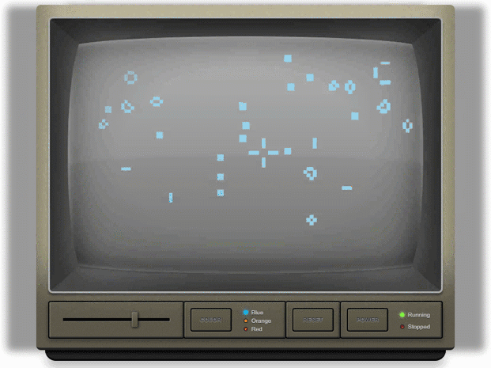
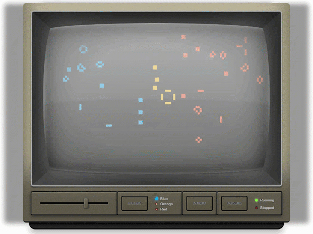

# trivago´s Game of Live
## Preface
Welcome to the trivago version of [Conway's Game of Life](https://en.wikipedia.org/wiki/Conway's_Game_of_Life).

This game is a cellular automaton, meaning it consists of a large matrix of cells that can change
state over time.

In its original version, the game determines its evolution by its initial state, requiring no further input. The evolution of cells to be alive or dead are specified by a few simple rules.

Given one cell's current living state, the game takes the cell's neighbours' states into account and then calculates the successor state for the cell.
This rule is called the `survivalRule` or `Rule#1`. You can find its implementation in `store/rules.js`.

Our version adds a rule-chain to the game. That means our game can work with several rules at a time, which will be chained together. To make it more interesting, we implemented multi-color support for the game by adding a `colorRule` in the same direction. More information on the rules are found in the code.

The implementation you are looking at is written in a functional flavor on top of our own js-framework [Melody](https://melody.js.org).
Detailed knowledge of the framework itself is not needed to solve this case study. In case you are interested or feel the urge to read more documentation you can find it at [https://melody.js.org](https://melody.js.org);

Unfortunately, for some reasons, there are parts missing in this application, some need refactoring and we also spotted a bug (ouch!). Further information is given in the section "Tasks".

## Requirements

Please make sure that you have Node.js and yarn|npm installed on your system. This
application is built with webpack, and without those two tools, you can't proceed.

* Node.js (recommended: >= 8.x)
* yarn (recommended: >= 1.2.x) or npm (recommended: >= 5.x)

## Setup

Once you're sure everything is in order, please install all required npm modules
by using the command:

```sh
yarn
```

To build and to keep rebuilding it while you're working on the project, use

```sh
yarn start
```

Once you've compiled the bundle, you can open the application in your browser

[http://localhost:3456](http://localhost:3456)


## The tasks

### WEB-101: Find and fix the bug in the application

You probably have run the application already. If not, press the `Power` button on the TV.
Oh, that is really disappointing ... we were expecting cell evolution based on our initial pattern.
After some hundred generations it **should** turn into:



But after two generations all cells are immediately dead.
You see the following:


Please find and fix the bug!

Hints:
The heavy lifting of the application is done by some core utility functions inside the `./utils` folder.
This methods are safe and working, so they don´t need to be parsed for errors by you.
We believe the bug is coming more from a logical perspective that `Conway´s Game of Life` is relying on to be working properly. One engineer we spoke to indicated that it might be a problem with the implementation of the rules.
**Tip: Read the comments in the code.**

<br>

### WEB-102: Finish multi-color support implementation

Well done! You fixed the bug in WEB-101!
After some hundred generations (and without setting additional cells by you) the evolution **should** be stable with the following switching pattern:




Instead, you're only getting blue cells evolving even though the application started with blue, orange and red cells:


Ah, right, our engineer fell sick while implementing the second rule before he could finish it. It is called `mostFrequentColor` and its helper function `getMostFrequentColor` is incomplete.
So this is your chance to implement it.
Please go to `./store/rules.js` and look out for *Task WEB-102*.

<br>

### WEB-103: A nicer reducer (OPTIONAL)

So, we have a working, coloured version now. Perfect.
Still, we think there should be some more refactorings done.

Take a look at `./store/index.js` and jump to the reducer.
It looks like a typical redux reducer, but our engineer had a great idea to remove the
duplication here as well.
Can you implement her idea?

<br>


### WEB-104: Remove code duplication by refactoring (OPTIONAL)

In the file `./view/index.js` our engineer did her best to remove boilerplate, noise and repetition by writing the helper functions `actionCreator` and `dispatchTo`.
These work well, but we still see a lot of duplication there.
Can you refactor these spots?

<br>

You have arrived at the end of the tasks! Well done!

We hope you had a bit of fun while working on this. If you want to know more about engineering at trivago, have a look at our [TechBlog](https://tech.trivago.com).